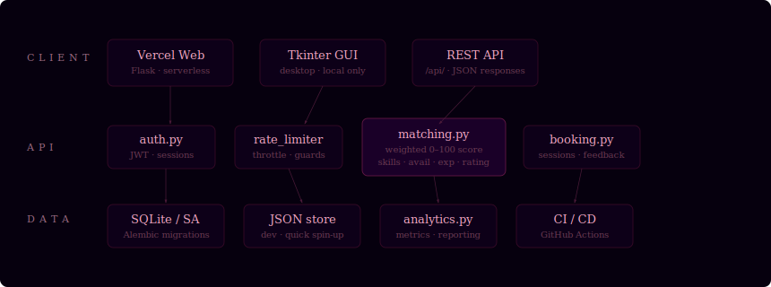

<table width="100%" bgcolor="#06000e" border="0" cellpadding="0" cellspacing="0">
<tr><td align="center">



</td></tr>

<tr><td align="center"><br/>

[](https://mentor-mentee-system.vercel.app)&ensp;[](https://github.com/yorayriniwnl/mentor-mentee-system)&ensp;[](https://python.org)&ensp;[](https://flask.palletsprojects.com)&ensp;[](https://vercel.com)

<br/>

> *Some connections don't happen by accident.*
> *They happen because something underneath decided they should.*

<br/>

</td></tr>

<tr><td bgcolor="#0a0015" align="center"><br/>
<sub><i>✦ &ensp; what this is &ensp; ✦</i></sub>
<br/><br/>
</td></tr>

<tr><td bgcolor="#0a0015" style="padding:0 10%">

Most mentorship platforms treat matching as a filter — pick a category, get a list. This system treats it as a problem worth solving properly. A weighted scoring engine evaluates every mentor against a mentee across four dimensions — skill overlap, availability, experience depth, and rating credibility — producing a 0–100 compatibility score that accounts for edge cases like new mentors with few sessions (who are penalized slightly until they've earned confidence).

The architecture runs three ways simultaneously: as a Vercel-deployed serverless API, as a local Flask server, and as a standalone Tkinter desktop app — all sharing the same core logic. The data layer is intentionally dual-track: SQLite with Alembic migrations for production, a JSON fallback for fast local development. Nothing is overengineered. Everything is replaceable.

<br/><br/>

</td></tr>

<tr><td align="center"><br/>
<sub><i>✦ &ensp; architecture &ensp; ✦</i></sub>
<br/><br/>



<br/><br/>
</td></tr>

<tr><td bgcolor="#0a0015" align="center"><br/>
<sub><i>✦ &ensp; how the matching engine works &ensp; ✦</i></sub>
<br/><br/>
</td></tr>

<tr><td bgcolor="#0a0015" style="padding:0 10% 2% 10%">

Every mentor-mentee pair receives a score out of 100, broken down as:

```python
# matching.py — scoring breakdown
W_SKILLS       = 40   # Jaccard overlap: mentor skills ∩ mentee wants / mentee wants
W_AVAILABILITY = 25   # shared available days, proportional
W_EXPERIENCE   = 20   # years, linear up to 15yr ceiling
W_RATING       = 15   # effective rating — penalised 25% if < 5 sessions completed
```

A mentor with 0 sessions and a perfect 5.0 rating scores the same on the rating component as one with 4.2 and 20 sessions. Credibility is earned, not assumed.

<br/><br/>

</td></tr>

<tr><td align="center"><br/>
<sub><i>✦ &ensp; tech stack &ensp; ✦</i></sub>
<br/><br/>

<table align="center" bgcolor="#0d0018" border="0" cellpadding="10" cellspacing="1" width="80%">
<tr bgcolor="#120020">
<td><sub><b>Layer</b></sub></td>
<td><sub><b>Technology</b></sub></td>
<td><sub><b>Why</b></sub></td>
</tr>
<tr bgcolor="#0d0018">
<td><sub>API framework</sub></td>
<td><sub>Flask</sub></td>
<td><sub>Thin, composable, deploys to Vercel as serverless with zero config change</sub></td>
</tr>
<tr bgcolor="#0a0015">
<td><sub>Desktop GUI</sub></td>
<td><sub>Tkinter</sub></td>
<td><sub>Ships with Python — no install friction for local institutional use</sub></td>
</tr>
<tr bgcolor="#0d0018">
<td><sub>Primary DB</sub></td>
<td><sub>SQLite + SQLAlchemy</sub></td>
<td><sub>File-based, zero-infra, Alembic handles schema evolution cleanly</sub></td>
</tr>
<tr bgcolor="#0a0015">
<td><sub>Dev datastore</sub></td>
<td><sub>JSON (data.json)</sub></td>
<td><sub>Spin up instantly with no migrations — swappable via database.py interface</sub></td>
</tr>
<tr bgcolor="#0d0018">
<td><sub>Auth</sub></td>
<td><sub>auth.py (JWT)</sub></td>
<td><sub>Stateless — works identically across serverless and local environments</sub></td>
</tr>
<tr bgcolor="#0a0015">
<td><sub>Rate limiting</sub></td>
<td><sub>rate_limiter.py</sub></td>
<td><sub>Custom throttle layer to protect matching and booking endpoints</sub></td>
</tr>
<tr bgcolor="#0d0018">
<td><sub>Migrations</sub></td>
<td><sub>Alembic</sub></td>
<td><sub>Schema versioning without an ORM lock-in</sub></td>
</tr>
<tr bgcolor="#0a0015">
<td><sub>CI / CD</sub></td>
<td><sub>GitHub Actions</sub></td>
<td><sub>Test + lint on every push, deploy to Vercel on merge to main</sub></td>
</tr>
</table>

<br/><br/>
</td></tr>

<tr><td bgcolor="#0a0015" align="center"><br/>
<sub><i>✦ &ensp; get started &ensp; ✦</i></sub>
<br/><br/>
</td></tr>

<tr><td bgcolor="#0a0015" style="padding:0 10% 2% 10%">

**Step 1 — Clone and install**
```bash
git clone https://github.com/yorayriniwnl/mentor-mentee-system.git
cd mentor-mentee-system
pip install -r requirements.txt
```

**Step 2 — Run the API server**
```bash
python -m flask --app app run --port 3000
# API is live at http://127.0.0.1:3000
```

**Step 3 — Or run the desktop GUI**
```bash
python main.py
# Opens the Tkinter interface — no browser needed
```

**Optional: set up the SQLite database with migrations**
```bash
python setup_db.py          # initialise schema
alembic upgrade head        # apply all migrations
```

`.env.example`
```env
SECRET_KEY=your_jwt_secret_here
DATABASE_URL=sqlite:///mentorship.db
FLASK_ENV=development
```

<br/><br/>

</td></tr>

<tr><td align="center"><br/>
<sub><i>✦ &ensp; api endpoints &ensp; ✦</i></sub>
<br/><br/>

<table align="center" bgcolor="#0d0018" border="0" cellpadding="10" cellspacing="1" width="80%">
<tr bgcolor="#120020">
<td><sub><b>Method</b></sub></td>
<td><sub><b>Endpoint</b></sub></td>
<td><sub><b>What it does</b></sub></td>
</tr>
<tr bgcolor="#0d0018"><td><sub>POST</sub></td><td><sub>/api/auth/login</sub></td><td><sub>Authenticate, return JWT</sub></td></tr>
<tr bgcolor="#0a0015"><td><sub>GET</sub></td><td><sub>/api/matches/&lt;mentee_id&gt;</sub></td><td><sub>Top-N scored mentors for a mentee</sub></td></tr>
<tr bgcolor="#0d0018"><td><sub>GET</sub></td><td><sub>/api/matches/&lt;mentor_id&gt;/&lt;mentee_id&gt;</sub></td><td><sub>Full score breakdown for a pair</sub></td></tr>
<tr bgcolor="#0a0015"><td><sub>POST</sub></td><td><sub>/api/booking</sub></td><td><sub>Book a session</sub></td></tr>
<tr bgcolor="#0d0018"><td><sub>POST</sub></td><td><sub>/api/feedback</sub></td><td><sub>Submit session feedback</sub></td></tr>
<tr bgcolor="#0a0015"><td><sub>GET</sub></td><td><sub>/api/analytics</sub></td><td><sub>Platform-wide metrics</sub></td></tr>
</table>

<br/><br/>
</td></tr>

<tr><td align="center">
<br/>
<sub><i>built because good connections deserve better infrastructure than a spreadsheet.</i></sub>
<br/><br/>
</td></tr>

<tr><td align="center">

</td></tr>

</table>
