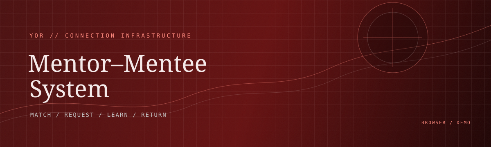
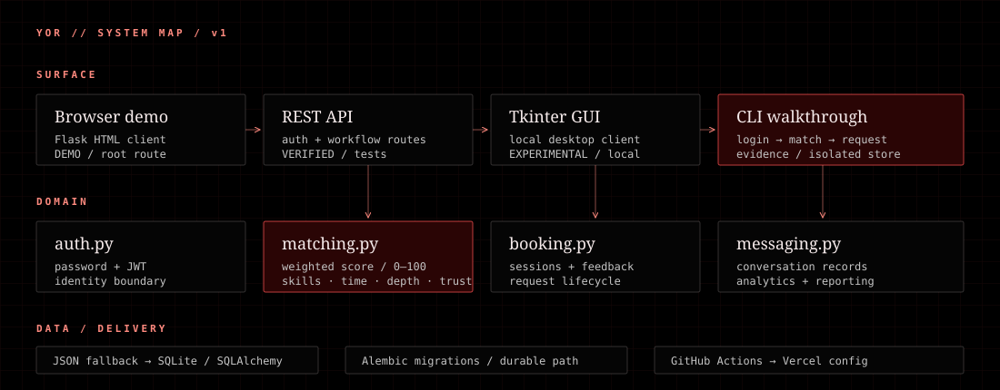

# YOR // Mentor–Mentee System

<p align="center">
  
</p>

<p align="center">
  <code>connection infrastructure</code> · <code>Flask API</code> · <code>Tkinter local client</code>
</p>

This repository contains a small mentorship workflow with a weighted matching engine, JWT authentication, session requests, messaging, feedback, analytics, and two local data paths. The browser surface is intentionally a compact demo client for exercising the API; the desktop client is local-only.

## Evidence contract

| Surface | State | What that means |
| --- | --- | --- |
| Flask API | `VERIFIED` | Covered by the repository's smoke and workflow tests. |
| Browser client | `DEMO` | A thin client for login, mentor selection, and session requests. |
| Matching engine | `EXPERIMENTAL` | Weighted scoring logic is available, but this is not a production recommendation system. |
| Tkinter GUI | `EXPERIMENTAL` | A local desktop path sharing the same modules; not available on Vercel. |
| Vercel deployment | `UNVERIFIED` | Deployment configuration exists; run a live probe before making availability claims. |

The repository does not claim production privacy, moderation, scheduling guarantees, or institutional approval. Configure secrets and a durable database before handling real users.

## Architecture

<p align="center">
  
</p>

The same Python modules can be used through:

- a Vercel-compatible Flask entrypoint in `api/index.py`;
- a local Flask server with the browser demo at `/`;
- the Tkinter app launched by `python main.py`;
- the CLI walkthrough launched by `python main.py --demo`.

`database.py` selects the storage implementation. JSON is useful for a quick local run; SQLite and SQLAlchemy/Alembic provide the migration-backed paths.

## Matching model

`matching.py` returns a score from 0–100 using the following weighted components:

| Component | Weight | Rule |
| --- | ---: | --- |
| Skill overlap | 40 | Fraction of requested skills covered by the mentor. |
| Availability overlap | 25 | Fraction of requested days shared with the mentor. |
| Experience | 20 | Linear score, capped at 15 years. |
| Rating credibility | 15 | Ratings from mentors with fewer than five completed sessions receive a 25% penalty. |

The score is an explanation aid, not a guarantee of a successful relationship. The source contains `score_breakdown()` for inspecting the component values.

## API surface

Routes are root-level; there is no `/api/` prefix in the current Flask app.

| Method | Route | Auth | Purpose |
| --- | --- | --- | --- |
| `GET` | `/` | No | HTML demo client or JSON metadata with `?format=json`. |
| `GET` | `/health` | No | Liveness probe. |
| `GET` | `/demo` | No | Isolated CLI walkthrough output as JSON. |
| `POST` | `/login` | No | Credential check without issuing a token. |
| `POST` | `/token` | No | Credential check and JWT issuance. |
| `GET` | `/me` | Bearer | Return the authenticated profile. |
| `GET/POST` | `/users` | Mixed | List users or create a user. |
| `GET` | `/users/<user_id>` | No | Read a public profile projection. |
| `GET` | `/mentors` | No | List mentor profile projections. |
| `GET/POST` | `/sessions` | Mixed | List or create session requests. |
| `GET/PUT` | `/sessions/<session_id>` | Mixed | Read or update a session. |
| `POST` | `/sessions/<session_id>/cancel` | Bearer | Cancel a session. |
| `GET/POST` | `/messages` | Mixed | Read or create messages. |
| `GET/POST` | `/feedback` | Mixed | Read or create feedback. |

Protected writes expect `Authorization: Bearer <token>`. The browser demo keeps the token in memory and is for local/API exploration, not a complete account experience.

## Run locally

```bash
python -m pip install -r requirements.txt

# Browser demo + API
python -m flask --app app run --port 3000

# CLI workflow walkthrough
python main.py --demo

# Local desktop client
python main.py
```

Optional migration-backed setup:

```bash
python setup_db.py
alembic upgrade head
```

At minimum, set a strong `JWT_SECRET`/`SECRET_KEY` outside of local demo mode and select a durable database before deployment.

## Verification

Run the same checks used for this repository slice:

```bash
python scripts/check_design_tokens.py
python -m pytest -q
python -m compileall -q .
```

The Redis-specific throttle test is skipped when Redis is unavailable. The CI workflow also exercises SQLite, ORM, and Redis paths in separate jobs.

## YOR visual contract

The visual source of truth is [`design/yor-tokens.json`](./design/yor-tokens.json). The browser client uses:

- void black `#000000` and graphite `#050505`;
- crimson `#e84b4b`, deep crimson `#671515`, and signal `#ff8a7f`;
- warm white `#f5eaea` and muted gray `#c4c4c4`;
- crimson field gradient `#671515` → `#8c1616` → `#2a0505`;
- grid, noise, mono annotations, serif hierarchy, and explicit evidence states.

Check the contract with `python scripts/check_design_tokens.py` after changing the landing surface or documentation.

## Project boundary

This is a portfolio-scale reference implementation. Live deployment status, secret configuration, database durability, abuse controls, consent, and institutional workflows remain release gates. Validate those independently before presenting the system as production-ready.

<p align="center"><sub>YOR / good connections deserve better infrastructure than a spreadsheet.</sub></p>
